  

<h1 align="center">Hamza Azam</h1>

  <strong>PhD Researcher · Zhejiang University (Ningbo Global Innovation Center)</strong> 
  <em>Biomechatronics · Musculoskeletal Modeling · Wearable Exoskeleton Control · Embedded Edge AI</em>

  
  
  

---

> *"I work at the interface of human locomotion and robotic intelligence — inferring what the body's joints are doing from the sparse data that can be captured outside a laboratory, and using those dynamics to drive wearable exoskeletons that adaptively harmonize with human movement."*

---